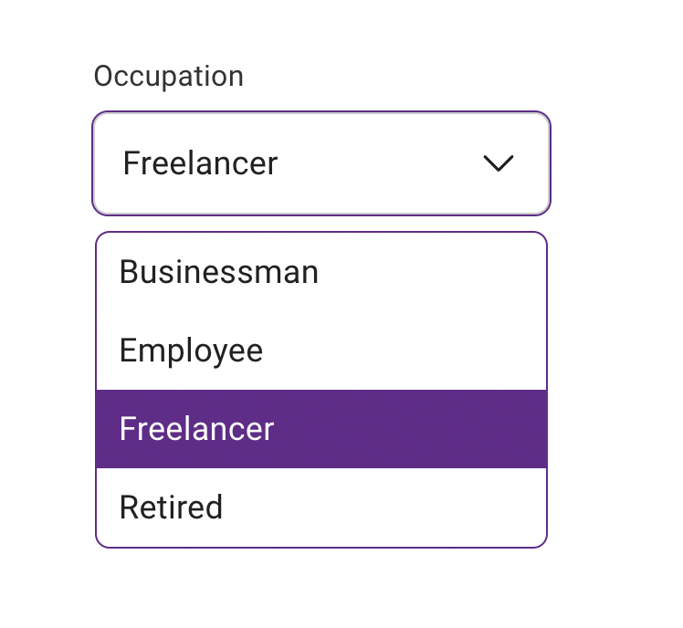
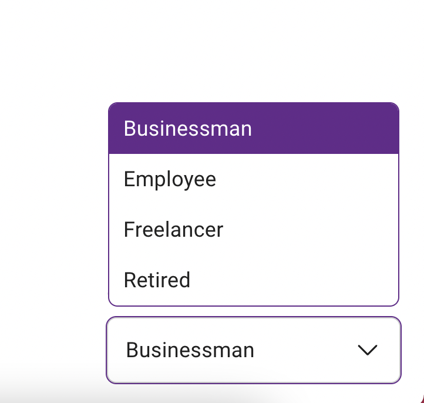

# Custom Select Component Project

## Overview

This project includes a custom select component built with React and TypeScript. The custom select component is designed to be fully accessible and responsive, suitable for various devices and screen sizes. It features custom dropdown positioning and handles keyboard navigation gracefully.

## Getting Started

### Prerequisites

- Node.js  >=18
- npm or yarn

### Installation

1. **Clone the repository:**

   ```bash
   git clone https://github.com/itsmebins/react-select
   cd react-select
   ```

2. **Install dependencies:**

   ```bash
   npm install
   ```

3. **Run the project:**

   ```bash
   npm run dev
   ```

   This will run the app in development mode. Open [http://localhost:5173](http://localhost:5173) to view it in your browser.

## Folder Structure

Here's an overview of the project's folder structure:

```
/custom-select-project
|-- /node_modules
|-- /public
|-- /src
|   |-- /components
|   |   |-- /CustomSelect
|   |   |   |-- CustomSelect.tsx
|   |   |   |-- styles.module.css
|   |-- /tests
|   |   |-- /CustomSelect
|   |   |   |-- CustomSelect.test.tsx
|   |-- App.tsx
|   |-- main.tsx
|-- package.json
|-- README.md
|-- tsconfig.json
|-- vite.config.ts
```

- `node_modules`: Node.js packages.
- `public`: Static files like the HTML file.
- `src`: Source code of the project.
  - `components`: React components.
    - `CustomSelect`: The custom select component and its styles.
  - `tests`: Test files for the components.
    - `CustomSelect`: Test file for the custom select component.
  - `App.tsx`: Main React application file.
  - `index.tsx`: Entry point for the React application.
- `package.json`: Project metadata and dependencies.
- `README.md`: Documentation of the project.
- `tsconfig.json`: TypeScript configuration.
- `vite.config.ts`: Vite configuration.

## Testing

To run tests:

```bash
npm run test
```

This will execute the test suite for the custom select component.


## Test Results




---